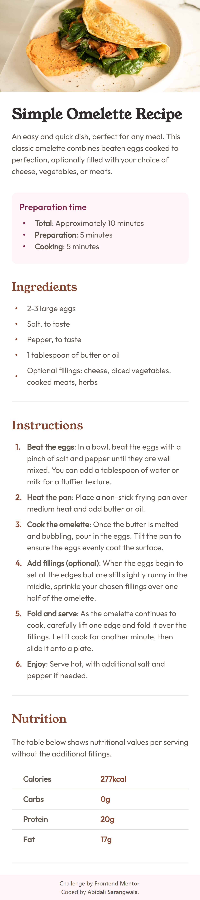
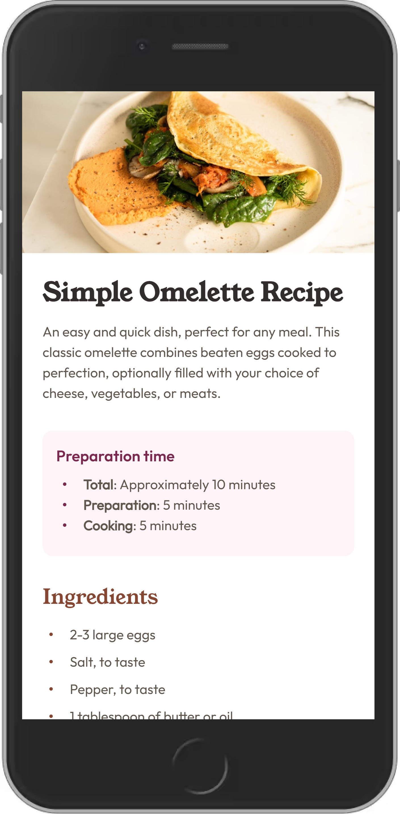

# Frontend Mentor - Recipe page solution

This is a solution to the [Recipe page challenge on Frontend Mentor](https://www.frontendmentor.io/challenges/recipe-page-KiTsR8QQKm). Frontend Mentor challenges help you improve your coding skills by building realistic projects. 

## Table of contents

- [Overview](#overview)
  - [The challenge](#the-challenge)
  - [Screenshot](#screenshot)
    - [Mobile](#mobile)
    - [Desktop](#desktop)
  - [Links](#links)
- [My process](#my-process)
  - [Built with](#built-with)
  - [What I learned](#what-i-learned)
  - [Useful resources](#useful-resources)
- [Author](#author)

## Overview
I successfully completed the recipe page challenge.
### Screenshot

#### Mobile

#### Desktop

### Links

- Solution URL: [Solution](https://www.frontendmentor.io/solutions/responsive-recipe-page-AdYY1n1Kiu)
- Live Site URL: [Github Live Site](https://caspgin.github.io/FMC---Recipe-page/src/index.html)

## My process

### Built with

- Semantic HTML5 markup
- CSS custom properties
- Flexbox
- CSS Grid
- Mobile-first workflow
- [TailwindCSS](https://tailwindcss.com/)
- Neovim

### What I learned
- I have tried to keep the tailwindcss code in parent tags so it is clean and more redable. Please let me know if I succeeded.
- I was able to figure out how to use psuedo classes and states like hover with tailwindcss. That was fun part.
- I am not completely sure I used the main tag properly.
    - I used it first just for Instruction and Ingredient section. But I am not sure that was correct either.
    - Please advice on how you use the main tag.

### Useful resources

- [TailwindCSS Docs](https://www.tailwindcss.com/docs) - The docs of tailwind are amazing. 

## Author

- Frontend Mentor - [@caspgin](https://www.frontendmentor.io/profile/caspgin)

